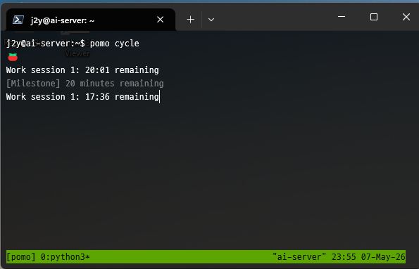

# 🍅 pomo — SSH-friendly CLI Pomodoro Timer

A minimal, terminal-native pomodoro timer built for **SSH sessions**. No curses, no TUI dependencies — just 
carriage-return countdowns that work over any connection.



## Features

- **Classic pomodoro flow** — 25m work / 5m break / 15m long break (all configurable)
- **SSH-friendly** — single-line `\r` countdown, works in tmux/screen/remote SSH
- **Full cycle automation** — `pomo cycle` runs 4 pomodoros with breaks automatically
- **Configurable** — TOML config file at `~/.pomo/config.toml`, CLI overrides
- **Zero heavy deps** — stdlib argparse + tomllib, pytest for tests

## Quick Start

```bash
# Install as a uv tool
uv tool install .

# Or run directly
uv run pomo work

# Try the commands
pomo work          # 25-min work session
pomo break         # 5-min short break
pomo long-break    # 15-min long break
pomo cycle         # full pomodoro cycle (4 rounds)
pomo config        # show current settings
```

## Usage

### Commands

| Command           | Description                                   |
| ----------------- | --------------------------------------------- |
| `pomo work`       | Start a focused work session                  |
| `pomo break`      | Take a short break                            |
| `pomo long-break` | Take an extended break                        |
| `pomo cycle`      | Run the complete pomodoro cycle automatically |
| `pomo config`     | Display your current configuration            |

### Override Durations

```bash
pomo work --minutes 50       # 50-min work session
pomo break --minutes 10      # 10-min break
pomo long-break --minutes 30 # 30-min long break
```

### Configuration

Create `~/.pomo/config.toml` (it is written automatically with these defaults on first run if missing):

```toml
[session]
work = 25              # work session duration (min)
short_break = 5        # short break duration (min)
long_break = 15        # long break duration (min)
sessions_before_long = 4  # pomodoros before long break
```

Priority: **defaults → config file → CLI flags**

### Custom Config Path

```bash
pomo --config /path/to/custom.toml work
```

## Session Behavior

- **Countdown**: Single-line display updated every second (`\r` overwrite)
- **Milestones**: Status message printed every 5 minutes elapsed
- **Completion**: Audible bell + summary line when session ends
- **Interrupt (Ctrl+C)**: Shows elapsed time, exits with code 1

## Development

```bash
# Run tests
make test

# Lint
make lint

# Install as global tool
make install
```

### Project Structure

```
src/pomo/
├── __init__.py     # package
├── art.py          # ASCII banners
├── cli.py          # argparse CLI entry point
├── config.py       # layered config (defaults → TOML → CLI)
└── timer.py        # countdown loop with display/bell/signals

tests/
├── test_cli.py     # 7 tests — command routing, overrides, cycle
├── test_config.py  # 8 tests — defaults, TOML, overrides, edge cases
└── test_timer.py   # 7 tests — countdown, milestones, bell, SIGINT
```

## Tech Stack

- **Python ≥ 3.11** (for `tomllib` stdlib)
- **argparse** — CLI parsing (stdlib)
- **pytest** — testing (`uv add --dev pytest`)
- **uv** — package manager and runtime
